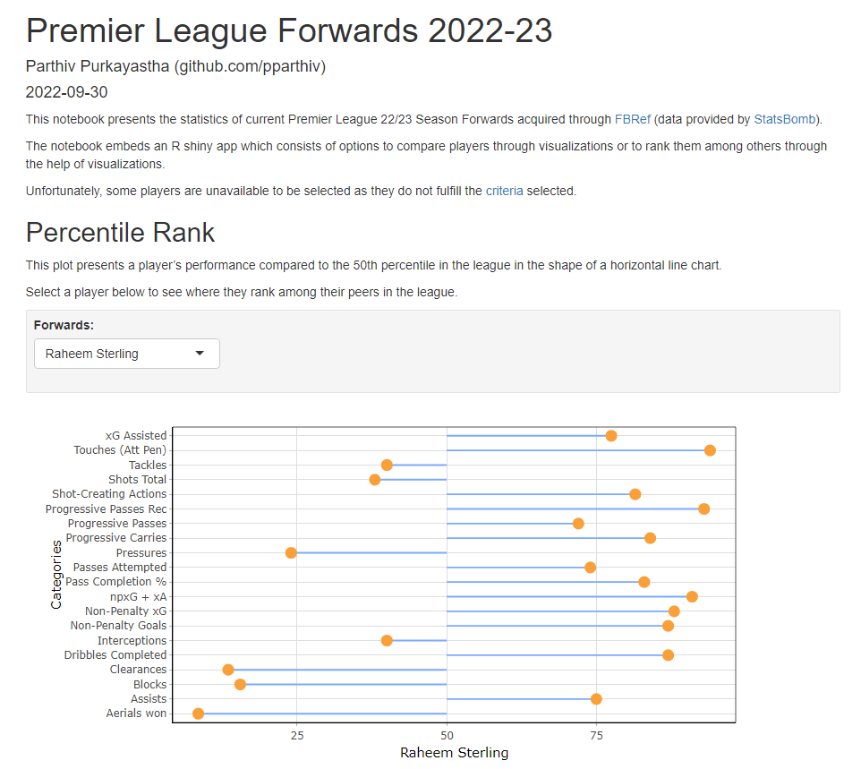
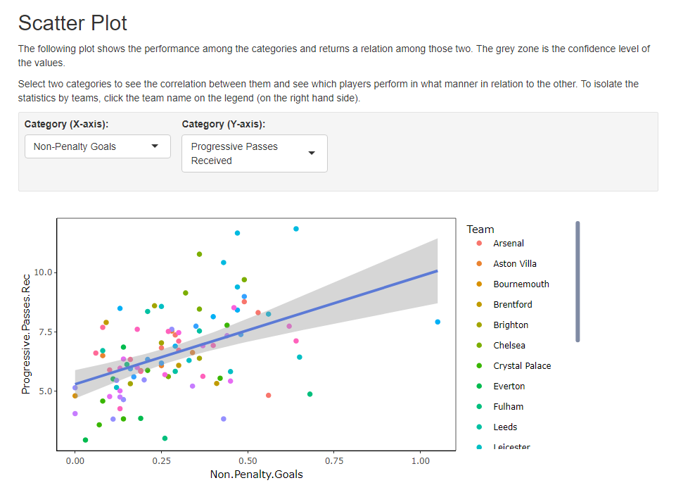

# Premier League 22/23 Forwards Stats

A dynamic RMarkdown project aiming to visualize the statistical performance of Premier League Forwards 2022/23.

You can view the **app online**, [Premier League 2022/23 Forwards](https://gdjpoi-parthiv-purkayastha.shinyapps.io/EPL_22_23_Forwards/), or go through the steps below to run them on your local machine.

## Prerequisites

Install [Python](https://www.python.org/downloads/), [R](https://cran.r-project.org/bin/windows/base/), and [RStudio](https://www.rstudio.com/products/rstudio/download/) to use the files.

To run the setup.py, install these Python libraries. 

```
$ pip install time
$ pip install pandas
$ pip install numpy
$ pip install tqdm
```
## Running the Scripts

To run the program go through the following steps.

### Clonning theRepository
First clone the repository.
```
$ git clone https://github.com/pparthiv/Premier-League-22-23-Forwards-Stats.git
```

### setup.py
Run the setup.py to update the player table to the latest version. The downloading time depends on the internet speed and may take longer on slower speeds.
You can use the software without updating the tables as well.


After updating the table, you may run the .Rmd file to see the visualizations.

### PremierLeagueFWsStats.Rmd
This is the RMarkdown file which is responsible for projecting the visuals.

Open the .Rmd file with RStudio. When opening for the first time, the file will require some time in order to finish downloading the required libraries.


And that is it. Now you can view the visualizations and see the statisical performances of Premier League 2022/23 Forwards. 





## Source

All the data has been made available by [FBRef](https://fbref.com) (provided by [StatsBomb](https://statsbomb.com/)).
